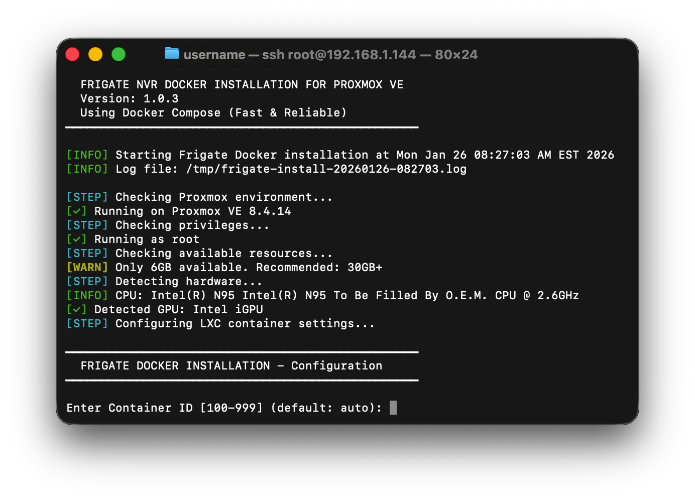
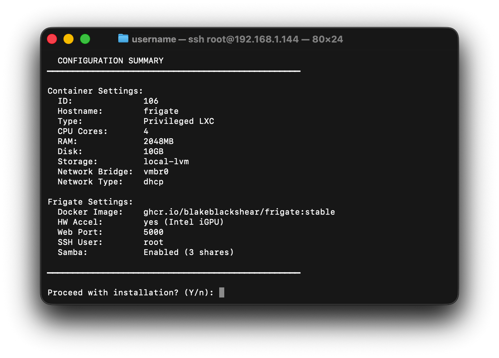

# Frigate Proxmox Script

An automated, Docker-based installation script for deploying [Frigate NVR](https://frigate.video/) on Proxmox VE using an LXC container. This script provisions the full stack end-to-end—no manual setup required.

### What it does:
1. Creates a privileged **LXC container**
2. Installs **Docker** and **Docker Compose**
3. Deploys **Frigate NVR** with Intel iGPU hardware acceleration

Optimized for the **Beelink S12** (Intel N95/N100), but compatible with most Intel-based Proxmox host.




## Features

✅ **Docker-Based** - Official Frigate images for reliability and speed  
✅ **Zero-Config Setup** - Smart hardware detection avoids manual indexing  
✅ **Intel, NVIDIA, & AMD** - Broad hardware acceleration support via VAAPI/NVDEC  
✅ **Hardware Auto-Detection** - Automatically identifies CPU, GPU, and Coral TPU  
✅ **Easy Updates** - Simple Docker pulls to keep your NVR current  
✅ **Home Assistant Ready** - Default ports and paths pre-configured  
✅ **Add-ons Included** - Optional SSH & Samba for easy file management  

## Requirements

- **Proxmox VE** 7.0 or later
- **Root access** on Proxmox host
- **Intel iGPU, NVIDIA GPU, or AMD GPU** (recommended for low CPU usage)
- **Google Coral TPU** (optional)

## Quick Start

### Option 1: One-Command Install (Recommended)

```bash
bash <(curl -s https://raw.githubusercontent.com/saihgupr/frigate-proxmox-script/main/install.sh)
```

### Option 2: Download and Run

```bash
wget https://raw.githubusercontent.com/saihgupr/frigate-proxmox-script/main/install.sh
bash install.sh
```

**Installation takes ~2 minutes**

## Usage

```bash
./install.sh [OPTIONS]

OPTIONS:
    --dry-run       Run in simulation mode (no actual changes)
    --verbose       Enable verbose output
    --help          Show help message
```

## Configuration Options

The script will prompt you for:

- **Container ID** - Choose between 100-999 (or auto-select)
- **Root Password** - Set a password for the `root` user (required for console login)
- **SSH** - Enable SSH access (uses Root Password automatically with `root` user)
- **CPU Cores** - Default: 4
- **RAM** - Default: 2048 MB (2GB recommended for Docker)
- **Disk Size** - Default: 10 GB (for recordings)
- **Network** - DHCP or static IP
- **Intel iGPU** - Enable hardware acceleration (recommended)
- **Web Port** - Default: 5000 (Home Assistant compatible)
- **Docker Image** - stable, beta, or custom version tag

## Post-Installation

### Adding Your Cameras

#### Method 1: Edit Config File via SSH

```bash
# Access Proxmox host, then edit the config
pct exec <CT_ID> -- nano /opt/frigate/config/config.yml
```

#### Method 2: Copy Config from Your Local Machine

```bash
# From your Mac/PC, copy your config.yml to Proxmox
scp config.yml root@<PROXMOX_IP>:/tmp/

# On Proxmox host, copy to container
pct push <CT_ID> /tmp/config.yml /opt/frigate/config/config.yml

# Restart Frigate to apply changes
pct exec <CT_ID> -- docker compose -f /opt/frigate/docker-compose.yml restart
```

#### Method 3: Use Frigate Web UI (Recommended)

Starting in Frigate 0.14+, you can edit the configuration directly in the web interface:

1. Go to `http://<CONTAINER_IP>:5000/config`
2. Click the **Edit** button
3. Make your changes
4. Click **Save** (Frigate will automatically restart)

### Samba Network File Sharing

If you enabled Samba during installation, you can access and edit Frigate files directly from your computer using network file shares.

**Available Shares:**

1. **`\\<CONTAINER_IP>\Frigate`** - Full Frigate installation directory (`/opt/frigate`)
2. **`\\<CONTAINER_IP>\Config`** - Configuration files only (`/opt/frigate/config`)
3. **`\\<CONTAINER_IP>\Media`** - Recordings and snapshots (`/opt/frigate/storage`)

**How to Connect:**

**Windows:**
1. Open File Explorer
2. Type in the address bar: `\\<CONTAINER_IP>\Config`
3. Press Enter
4. Navigate to `config.yml` and edit with your favorite text editor

**macOS:**
1. Open Finder
2. Press `Cmd + K` (or Go → Connect to Server)
3. Enter: `smb://<CONTAINER_IP>/Config`
4. Click Connect
5. Edit `config.yml` in any text editor

**Linux:**
```bash
# Mount the share
sudo mount -t cifs //<CONTAINER_IP>/Config /mnt/frigate -o guest

# Edit config
nano /mnt/frigate/config.yml
```

**Share Details:**
- **Authentication**: Guest access enabled (no password required by default)
- **Password**: If you configured Samba during installation, you can also authenticate with:
  - Username: `root`
  - Password: The root password you set during installation
- **Permissions**: Full read/write access
- **User**: All files created as `root` user automatically

### File Locations

```
/opt/frigate/
├── docker-compose.yml      # Docker Compose configuration
├── config/
│   └── config.yml         # Frigate configuration
└── storage/               # Recordings and snapshots
```

## Hardware Acceleration

## How Smart Detection Works

The script performs a "pre-flight" scan of your Proxmox host to determine the best possible configuration for your specific hardware:

1.  **CPU Identification**: Detects your processor model to optimize OpenVINO performance.
2.  **GPU Passthrough**: 
    - **Intel/AMD**: Automatically detects `/dev/dri/` and configures VAAPI.
    - **NVIDIA**: Detects the presence of NVIDIA drivers and configures the NVIDIA Container Runtime in LXC.
3.  **Detector Optimization**:
    - If a **Google Coral (USB or PCIe)** is found, it's set as the primary detector.
    - If no Coral is found, it utilizes **OpenVINO** (favoring the iGPU if available, otherwise falling back to CPU).

### Verify Hardware Acceleration

```bash
# Check if device is accessible in container
pct exec <CT_ID> -- ls -l /dev/dri/renderD128

# View Frigate logs for hardware acceleration status
pct exec <CT_ID> -- docker logs frigate 2>&1 | grep -i vaapi

# View GPU usage
sudo intel_gpu_top
```

### Example Config with Hardware Acceleration

```yaml
ffmpeg:
  hwaccel_args: preset-intel-qsv-h264

detectors:
  ov:
    type: openvino
    device: GPU
    model_path: /openvino-model/ssdlite_mobilenet_v2.xml

model:
  width: 300
  height: 300
  input_tensor: nhwc
  input_pixel_format: bgr
  labelmap_path: /openvino-model/coco_91cl_bkgr.txt

detect:
  enabled: true
```

<details>
<summary><h2>Troubleshooting</h2></summary>

### Container won't start
```bash
# Check LXC status
pct status <CT_ID>

# View container logs
pct exec <CT_ID> -- journalctl -xe
```

### Frigate not accessible
```bash
# Check if Docker container is running
pct exec <CT_ID> -- docker ps

# Check Frigate logs
pct exec <CT_ID> -- docker logs frigate

# Verify port in docker-compose.yml
pct exec <CT_ID> -- cat /opt/frigate/docker-compose.yml | grep -A2 ports
```

### Hardware acceleration not working
```bash
# Check if iGPU device exists
pct exec <CT_ID> -- ls -l /dev/dri/

# Test VAAPI
pct exec <CT_ID> -- docker exec frigate vainfo
```

### NVIDIA GPU Errors
If you see `Error running prestart hook #0` or `libnvidia-ml.so.1: cannot open shared object file`:

1.  **Check Host Drivers**: Run `nvidia-smi` on your Proxmox host. If it fails, your host-level drivers are broken.
2.  **Fix Missing Libraries**: On the Proxmox host, run:
    ```bash
    sudo ln -s /usr/lib/x86_64-linux-gnu/libnvidia-ml.so.1 /usr/lib/libnvidia-ml.so.1
    ```
3.  **Host Toolkit**: Ensure `nvidia-container-toolkit` is installed on the **Proxmox host** itself, not just inside the LXC.

### Configuration errors
```bash
# Validate YAML syntax
pct exec <CT_ID> -- docker exec frigate python3 -c "import yaml; yaml.safe_load(open('/config/config.yml'))"

# Check Frigate logs for config errors
pct exec <CT_ID> -- docker logs frigate 2>&1 | grep -i error
```

</details>

## Updating Frigate

### Option 1: The Easy Way (Script)

Run this single command on your Proxmox host shell:

##### Interactive
```bash
bash <(wget -qO- https://raw.githubusercontent.com/saihgupr/frigate-proxmox-script/main/update.sh)
```

##### Update to latest stable
```bash
bash <(wget -qO- https://raw.githubusercontent.com/saihgupr/frigate-proxmox-script/main/update.sh) \
  --id <CT_ID> \
  --version latest
```

##### Update to latest beta
```bash
bash <(wget -qO- https://raw.githubusercontent.com/saihgupr/frigate-proxmox-script/main/update.sh) \
  --id <CT_ID> \
  --version beta
```

##### Update to a specific version
```bash
bash <(wget -qO- https://raw.githubusercontent.com/saihgupr/frigate-proxmox-script/main/update.sh) \
  --id <CT_ID> \
  --version 0.17.0-rc2
```

It will ask for your Container ID and let you pick the version from a list.

### Option 2: The Manual Way

1. Edit your compose file. Replace `<CT_ID>` with your container ID (e.g., 100).

   ```bash
   pct exec <CT_ID> -- nano /opt/frigate/docker-compose.yml
   ```
   
   Change the image line to the desired version, e.g.:
   `image: ghcr.io/blakeblackshear/frigate:0.17.0-rc1`

2. Pull the new image and recreate the container:

   ```bash
   pct exec <CT_ID> -- docker compose -f /opt/frigate/docker-compose.yml pull
   pct exec <CT_ID> -- docker compose -f /opt/frigate/docker-compose.yml up -d
   ```

3. Verify:
   Check `http://<YOUR_FRIGATE_IP>:5000/api/version` to confirm the update.

## Uninstallation

```bash
# Stop and destroy the container
pct stop <CT_ID>
pct destroy <CT_ID>
```

## Based On

- **Tutorial**: [Installing Frigate NVR on Proxmox](https://www.mostlychris.com/installing-frigate-nvr-on-proxmox-in-an-lxc-container/)
- **Official Docs**: [Frigate Installation](https://docs.frigate.video/frigate/installation)
- **Docker**: [Official Frigate Docker Image](https://github.com/blakeblackshear/frigate)

## Contributing

Issues and pull requests are welcome! Star the repo if you find it useful. ⭐
